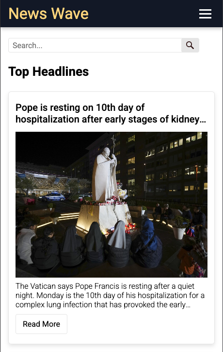
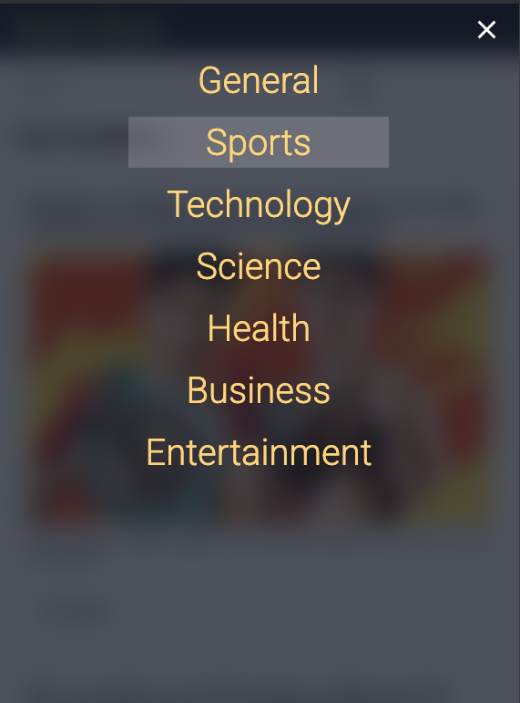

# Page with news from NewsAPI (HTML/JS/CSS)

- Allows you to open news from US by top headlines in header-menu.
- Or you can use Search to search news globaly (supports many langages)

## Here how the news page looks like

On Large Screen


On Medium Screen


On Small Screen



Mobile Nav



## How to run locally

NewsAPI has restrictions on free plan. So you need to run this page via localhost to get the news.

Clone Repository

```
git clone https://github.com/gudzilla/news-page.git
```

Then run the localhost and use the page with news.
